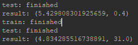

# Network Setting Result
### old setting
- reduce input information by replacing energy degeneracies by that degree of degeneracies \

### new setting
- keep the original energy level \

- ratio only: all the entry is divided by the maximum absolute value \
.PNG)
	- axis is the range for the maximum (0 for column, 1 for row) \
	.PNG)
	.PNG)
- softmax: similar to sigmoid but result sums up to 1 \
.PNG)
	- axis is the range for the normalization (0 for column, 1 for row) \
	.PNG)
	.PNG)
